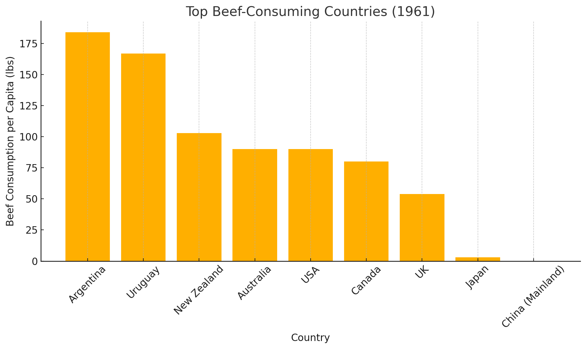
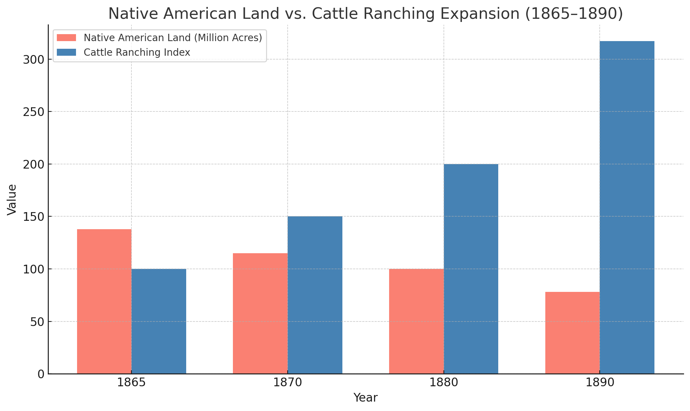

# Beef and Barbarism: A Data-Driven Analysis of America's Meat Industry

This project is an excerpt from a larger research effort examining the relationship between meat consumption, settler colonialism, and racial capitalism in 19th-century America. In this focused slice of the work, I use historical data to explore how beef consumption patterns and the expansion of cattle ranching were tied to Native American land dispossession and the construction of racial hierarchies.

The visualizations here highlight two core findings:
- A side-by-side view of Native land loss and cattle ranching growth (1865–1890)
- Per capita beef consumption by country in 1961, reflecting global inequality rooted in colonial histories

This notebook and report were created using Python (matplotlib, pandas) and incorporate both quantitative analysis and historical context. They were developed as part of my data science portfolio to demonstrate applied skills in visualization, historical data interpretation, and storytelling.

## 📊 Key Features
- Historical beef consumption by region and nation (1961)
- Indexed comparison of Native land loss and cattle expansion (1865–1890)
- Visuals created in Python using matplotlib
- Contextual analysis combining data and primary sources

## 🧰 Tools Used
- Python (Pandas, Matplotlib)
- Microsoft Word (Report layout)
- Data sourcing from FAOSTAT, "Invasion of America," USDA Census

## 📈 Visuals

**Top Beef-Consuming Countries (1961):**  

**Native American Land vs. Cattle Ranching Expansion (1865–1890):**  

## 📄 Full Report
[Download Report (DOCX)](Beef_and_Barbarism_Data_Internship_Portfolio.docx)

## 📚 Sources
- FAOSTAT (1961 consumption data)
- University of Nebraska – "Invasion of America"
- USDA Agricultural Census (historical estimates)
